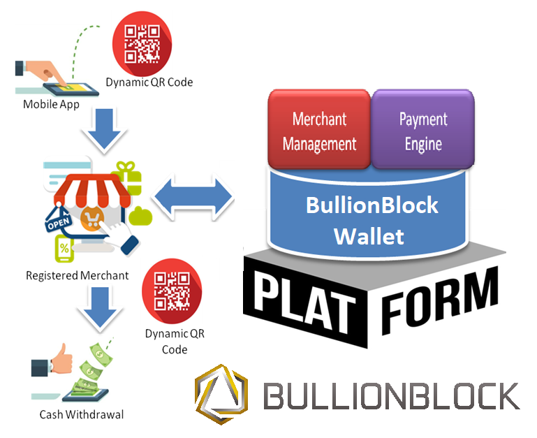

# Case Study Proposal: BULLIONBLOCK

## What Is It

BULLIONBLOCK is a FinTech startup company incorporated in Hongkong,Australia,UK, USA and parent company headquatered in singapore-uses omni-channel frictionless digital payments platform. BULLIONBLOCK is a next-generation mobile digital financial application powered by Blockchain Technology, that protects the customer currency accounts with physical Gold & Silver Bullion – a Wealth-Preservation Ecosystem.
BULLIONBLOCK aims to democratize banking and revolutionize money transfer as well as personal money services, as an alternative to the contemporary intervenor such as banks and payment operators.
BULLIONBLOCK is designed to connect diverse financial systems and  allow anyone to facilitate low cost digital financial transactions, increase revenue and remove friction by delivering a lifestyle product on a mobile platform providing a better experience. In other words, a user-friendly electronic money account that inspires and meets the individual needs of the digital age users.
Founded in September 2018 with a "People Before Profit" philosophy and built on decentralized physical gold and sliver backed platform, BULLIONBLOCK is not tied to one specific government, country, currency or any specific bank. The solutions are specially tailored to those who want to buy gold and silver bullion-backed Blockchain money service. Eventhough cryptocurrencies do not have inherentvalue or the assets may lose value. In an uncertain geopolitical environment, BULLIONBLOCK is where everyone can feel safe about their money. 
BULLIONBLOCK will shake the financial ecosystem by decentralizing and operating on Blockchain technology.

## Why This Matters

In traditional financial markets, new companies or start-ups usually go through private venture capital channels to raise capital, while more established companies may instead undergo an initial public offering (IPO) to raise capital from investors via the public markets. While BULLIONBLOCK's vision of focusing on end to end value propositon encompassing digital platform for all services, thus leveraging a diverse range of value chain strategic partnership by launching token distribution event on 29th October 2018 through community program. The Token ICO smart-contract consist of buyback strategy for token holders as pre-IPO exit strategy. Cryto Mint ICO token which is a profit-share smart contract, the ICO is emitted on the Ethereum Blockchain. Therefore, BULLIONBLOCK's vision to become trusted global payment gateway pioneer in remmittance and monetary transactions by providing low fee serivce to underbanked and migrant workers. Be part of their Token Distribution Event and support the ICO (http://www.crypto-mint.io/) to establish a real alternative for traditional banking.

## Why This May be Interesting

BULLIONBLOCK is a world’s first fully Encrypted Ledger System on decentralized private permission-based Blockchain.  This provides extra levels of security as opposed to public open-source-based Blockchain systems such as Hyperledger and Ethereum. 
BULLIONBLOCK system framework is designed with various modules that are fully compliant to the PA-DSS mandates, including the OWASP compliance of the Mobile and Web UI Front end as laid out by the PCI Security Standards Council. while BULLIONBLOCK decentralized Blockchain framework is a private and permission-based network with the smart distribution of data in a hybrid environment that meets compliance with European Data Standards (GDPR).

BULLIONBLOCK is a crisis-proof and conflict-free platform who provides borderless banking-as-a-service account supporting multiple fiat and cryptocurrencies enabling the users to pay bills, send money, receive money, purchase goods, conduct trading, and business transactions and/or spend money all around the world seamlessly through the BULLIONBLOCK Wallet. This wallet helps to merge traditional and crypto banking by enabling customers to control their financial affairs from anywhere with any device.

With a Debit card linked to the BULLIONBLOCK Wallet account, customers have access to spend their money globally, withdraw cash from ATMs and pay bills online or send and receive fiat and digital currency. The user has the option of a standard Wallet Account and/or the BULLIONBLOCK Gold and Silver Bullion-backed Wallet Account.  In other words, a wealth-preservation decentralized digital Wallet system designed as a hedge against currency devaluation and inflation. In nutshell, BULLIONBLOCK Wallet can be used for retail payments using dynamic and encrypted wallet QR code process.

The BULLIONBLOCK Wallet app includes features such as the Peer-to-Peer (P2P) Community, with unique next-generation online e-Marketplace within the Ecosystem where users can be buyers and sellers of goods and services. This feature will also have its own dedicated specific designed website providing a personal profile option for the BULLIONBLOCK Community members with live chat and much more.

## The worldwide impact if BULLIONBLOCK's vision proves to be successful
BULLIONBLOCK developed with purpose of providing alternative to the current banks and money system which enables users full control of their money; also provides shield against another global financial crisis or anyother situation like systematic debt collapse.
If the Crypto Mint Blockchain Technology (BULLIONBLOCK) vision proves to be succcessful than it has the potential to lead a way in a new paradigm of economic cooperation. The BULLIONBLOCK blockchain will be a  custom built platform that help the user to convert fiat currency into bullion backed crypto-assets and reconvert these crypto-assets back into fiat currency to facilitate border crossings and international digital transactions. In short it will allow seamless access to the User’s funds and grant them the ability to direct them wherever required, including existing traditional bank accounts.
The platform helps the user move his or her wealth in the form of physical Bullion backed money both rapidly and easily from one part of the world to another; and helps companies and individuals hedge their physical Bullion against market volatility and or for profit.
BULLIONBLOCK is a genuine H2H (Human-To-Human) designed Fintech that will give real value and accessibility to people who need it the most – the retirees, working class, the unbanked and underbanked, the entrepreneurs and SMEs etc.
As Airbnb completely revolutionize the travel and hospitality business, Similarly BULLIONBLOCK vision is to provide upended money and remittance services to the indsutry.

## How BULLIONBLOCK works and how it's making a difference in the traditional financial services

The below diagram describes the overall system architecture of BULLIONBLOCK Wallet app which uses P2P Community Market place portal:

The BullionBlock Wallet can be used for retail payments using the dynamic and encrypted Wallet QR Code process, as shown in the diagram below:

## Resources

* [About BULLIONBLOCK] (https://bullionblock.money/about/)
* [How BULLIONBLOCK Works] (https://apacbusinessheadlines.com/Digital_Wallet_web_version/ILIAS-BAFAS/)
* [BULLIONBLOCK's vision and operations] (https://bullionblock.ltd/2019/04/BULLIONBLOCK-Deck-March-2019.pdf)