# Unit 18 | Homework Assignment: Part 2: Proof of Authority Development Chain

### Background

You have just landed a new job at ZBank, a small, innovative bank that is interested in exploring what
blockchain technology can do for them and their customers.

Your first project at the company is to set up a private testnet that you and your team of developers
can use to explore potentials for blockchain at ZBank.

You have decided on setting up a testnet because:

There is no real money involved, which will give your team of developers the freedom to experiment.

Testnets allows for offline development.

Tokens inherently have no value here, so we will provide pre-configured accounts and nodes for easy setup.

After creating the custom development chain, create documentation for others on how to start it using the pre-configured
nodes and accounts. You can name the network anything you want, have fun with it!

Be sure to include any preliminary setup information, such as installing dependencies and environment configuration.

### Instructions

#### Setup the custom out-of-the-box blockchain

* A new project directory for my new network is bullion_config.

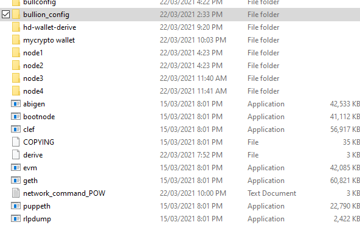

* Create accounts for two (or more) nodes for the network with a separate `datadir` for each using `geth` using following command..
    ./geth --datadir node3 account new
    ./geth --datadir node4 account new

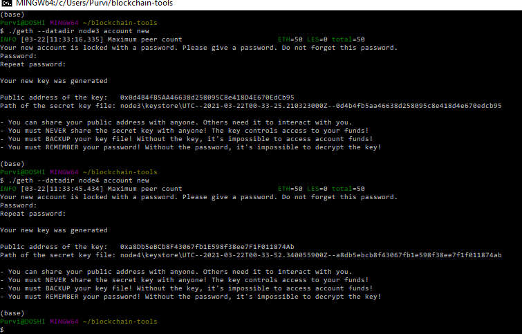

* Run `puppeth`, name my network as bullion_config, and select the appropirate option to configure a new genesis block.

* Choose the `Clique (Proof of Authority)` consensus algorithm.

* Paste follwoing two account addresses from the first step one at a time into the list of accounts to seal.
    1.0d4B4fB5AA46638d258095C8e418D4E670EdCb95
    2.a8Db5eBCb8F43067fb1E598f38ee7F1F011874Ab
* Paste them again in the list of accounts to pre-fund. There are no block rewards in PoA, so you'll need to pre-fund.

* I choose `no` for pre-funding the pre-compiled accounts (0x1 .. 0xff) with wei. This keeps the genesis cleaner.

* Complete the rest of the prompts, and when I was back at the main menu, choose the "Manage existing genesis" option.

* Export genesis configurations. This will fail to create two of the files, but you only need `bullion_config.json`.

* I deleted the `bullion_config-harmony.json` file.

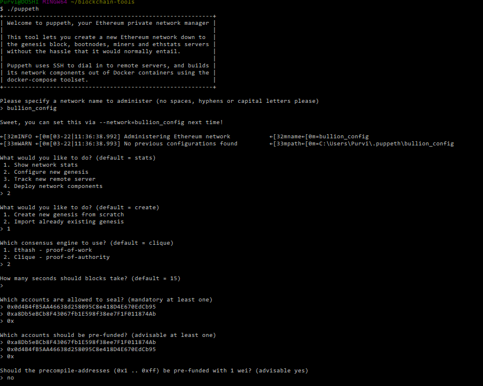

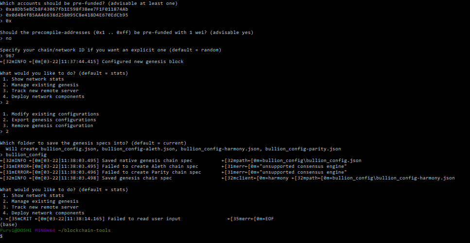

* Initialize each node with the new `bullion_config.json` with `geth` using following command.
    ./geth --datadir node1 init bullion_config/bullion_config.json
    ./geth --datadir node2 init bullion_config/bullion_config.json

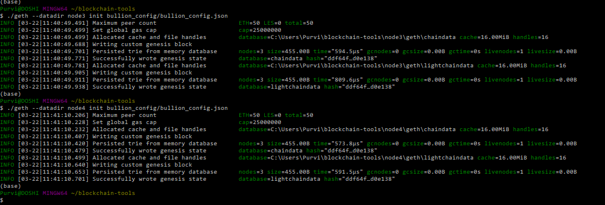

* Run the first node using following command, unlock the account, enable mining, and the RPC flag. Only one node needs RPC enabled.
    ./geth --datadir node3 --unlock "0d4B4fB5AA46638d258095C8e418D4E670EdCb95" --mine --rpc --allow-insecure-unlock
* Set a peer port 30304 for the second node and use the first node's `enode` address as the `bootnode` flag.
    ./geth --datadir node4 --unlock "a8Db5eBCb8F43067fb1E598f38ee7F1F011874Ab" --mine --port 30304 --bootnodes "enode://9965be004fb36f81dd1c5a5be71fcdfb6d930dc71707b460c8855bb72869c6bc3dfae9ddb4633db7b856cf18214841bf61a11cdeb1021ea0339a2fe249c7dd98@127.0.0.1:30303" --ipcdisable --allow-insecure-unlock

#### Send a test transaction

* Use the MyCrypto GUI wallet to connect to the node with the exposed RPC port.

* You will need to use a custom network, and include the chain ID, and use ETH as the currency.

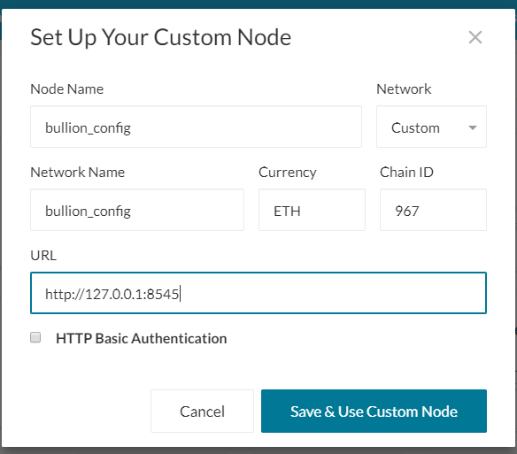

* Import the keystore file from the `node3/keystore` directory into MyCrypto. This will import the private key.
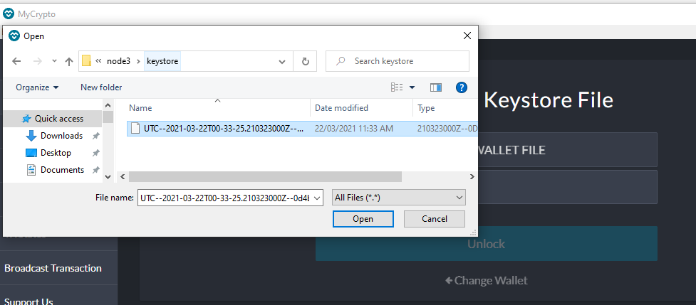
* Send a transaction from the `node3` account to the `node4` account.

* Copy the transaction hash and paste it into the "TX Status" section of the app, or click "TX Status" in the popup.
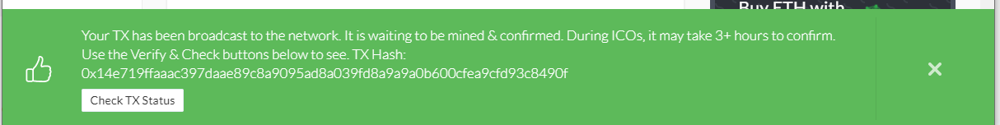
* Screenshot the transaction metadata (status, tx hash, block number, etc) and save it to your Screenshots folder.
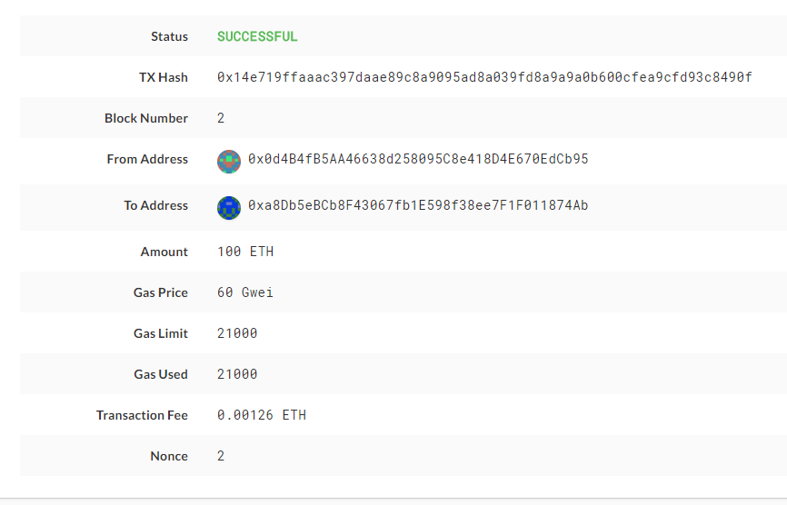

### Another Sample Transaction
* Send a transaction from the `node3` account to the `node4` account.
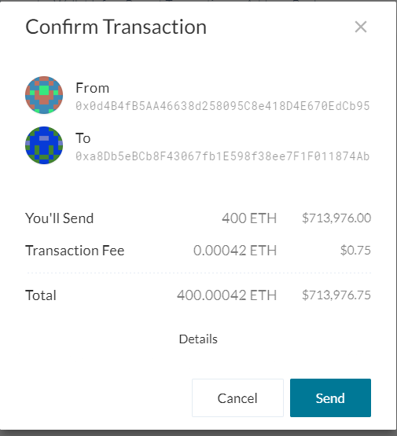
* Copy the transaction hash and paste it into the "TX Status" section of the app, or click "TX Status" in the popup.

* Screenshot the transaction metadata (status, tx hash, block number, etc) and save it to your Screenshots folder.
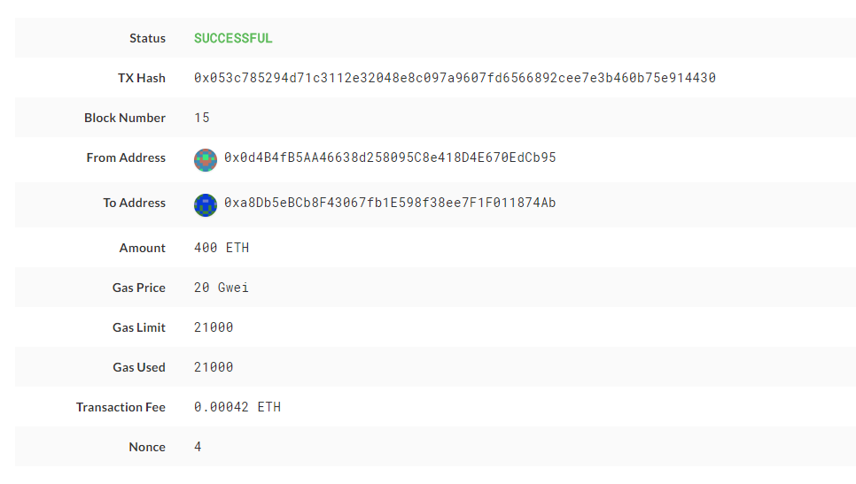

**_Celebrate the success of sending transaction and creating blockchain!
